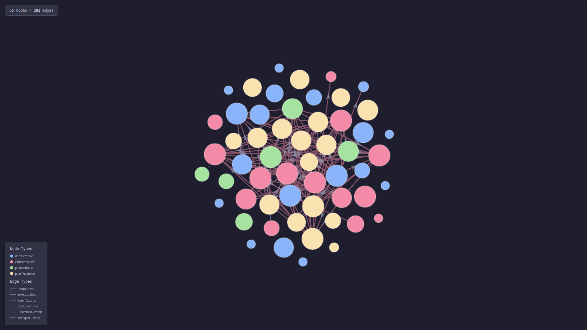

# f(eedback)loop

[](https://github.com/nvandessel/feedback-loop/actions/workflows/ci.yml)
[](https://github.com/nvandessel/feedback-loop/releases/latest)
[](https://go.dev/)
[](LICENSE)

**Persistent memory for AI coding agents.**

floop captures corrections you make to AI agents, extracts reusable behaviors, and activates them in the right context — so your agents learn from mistakes and stay consistent across sessions. It uses spreading activation (inspired by how the brain retrieves memories) to build an associative "blast radius" around your current work — not just direct matches, but related behaviors that provide useful context and bolster the AI's understanding.

## Features

- **Learns from corrections** — Tell the agent what it did wrong and what to do instead; floop turns that into a durable behavior
- **Context-aware activation** — Behaviors fire based on file type, task, and semantic relevance — not a static prompt dump
- **Spreading activation** — Graph-based memory retrieval inspired by cognitive science (Collins & Loftus, ACT-R) — triggered behaviors propagate energy to related nodes, pulling in associative context
- **Token-optimized** — Budget-aware assembly keeps injected context within limits
- **Store management** — Stats, deduplication, backup/restore, and graph visualization keep your behavior store healthy
- **MCP server** — Works with any AI tool that supports the Model Context Protocol
- **CLI-first** — Every operation available as a command with `--json` output for agent consumption

## Quick Start

```bash
# Install
go install github.com/nvandessel/feedback-loop/cmd/floop@latest

# Initialize in your project
cd your-project
floop init

# Teach it something
floop learn --wrong "Used fmt.Println for errors" --right "Use log.Fatal or return error"

# See what it learned
floop list

# See what's active for your current context
floop active
```

### Beyond Quick Start

```bash
# Check your behavior store health
floop stats

# Build an activation prompt for your current context
floop prompt --file src/main.go --task development

# Connect related behaviors
floop connect <source-id> <target-id> --kind similar-to

# Deduplicate your behavior store
floop deduplicate --dry-run
```

### Integrate with your AI tool

Add floop as an MCP server so your AI tool loads behaviors automatically.

**Claude Code** (`~/.claude/settings.json`):
```json
{
  "mcpServers": {
    "floop": {
      "command": "floop",
      "args": ["mcp-server"]
    }
  }
}
```

See [docs/integrations/](docs/integrations/) for setup guides for Cursor, Windsurf, Copilot, and more.

## How It Works

```
 You correct          floop extracts         Behaviors stored         Spreading activation        Context injected
 your agent     →     a behavior       →     in a graph         →    finds relevant nodes   →    into next session
      ↑                                                                                               │
      └───────────────────────── agent improves, cycle repeats ────────────────────────────────────────┘
```

When you correct your AI agent, floop captures the correction and extracts a **behavior** — a reusable rule with context conditions. Behaviors are stored as nodes in a graph, connected by typed edges (similar-to, learned-from, requires, conflicts). When you start a session, floop builds a context snapshot (file types, task, project) and uses **spreading activation** to propagate energy through the graph from seed nodes. This doesn't just retrieve direct matches — energy cascades outward through associations, pulling in related behaviors that provide useful context. The result is a focused but rich set of behaviors tuned to your current work, like the brain activating related memories through associative networks.

<p align="center">
  
  <br>
  <em>Interactive behavior graph built from real corrections — nodes are behaviors (colored by type), edges are relationships.</em>
</p>

## Documentation

- [CLI reference](docs/CLI_REFERENCE.md) — Complete reference for all commands and flags
- [Usage guide](docs/FLOOP_USAGE.md) — How to use floop via MCP or CLI
- [Walkthrough](docs/WALKTHROUGH.md) — Teach your agent in 5 minutes (start here)
- [Similarity pipeline](docs/SIMILARITY.md) — How deduplication and similarity detection work
- [Integration guides](docs/integrations/) — Setup for Claude Code, Cursor, Windsurf, and others
- [Research & theory](docs/SCIENCE.md) — The cognitive science behind spreading activation
- [Origin story](docs/LORE.md) — How floop came to be
- [Contributing](CONTRIBUTING.md) — How to contribute
- [Releases](https://github.com/nvandessel/feedback-loop/releases) — Release history

## Project Status

floop is a working tool I use daily to build floop itself (160+ learned behaviors and counting). It's a hobby project built in my free time — actively maintained, tested (90%+ coverage on core packages, race-clean), and used in production on my own workflows. The CLI and MCP interfaces are stable; internals may evolve between minor versions. Contributions and feedback are welcome.

## License

[Apache License 2.0](LICENSE)
