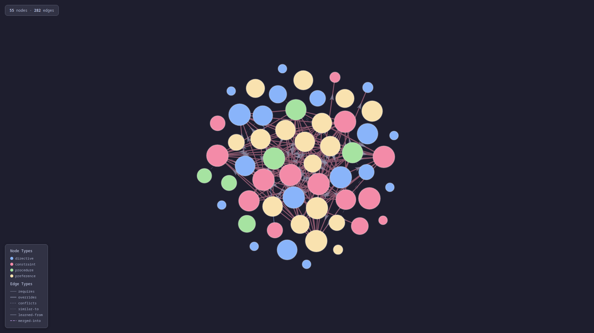

# f(eedback)loop

[](https://github.com/nvandessel/floop/actions/workflows/ci.yml)
[](https://github.com/nvandessel/floop/releases/latest)
[](https://go.dev/)
[](LICENSE)
[](https://goreportcard.com/report/github.com/nvandessel/floop)
[](https://pkg.go.dev/github.com/nvandessel/floop)

Every correction you give an AI agent is a lesson that dies at the end of the session. floop makes it stick.

A correction becomes a behavior. Behaviors connect into a graph. The graph uses spreading activation — the same model cognitive science uses to describe how human memory retrieves associations — to find the right behaviors for your current context. Connections strengthen through Hebbian learning. The result is an agent that gets better over time instead of starting from zero every morning.

## Features

- **Learns from corrections** — Tell the agent what it did wrong and what to do instead; floop turns that into a durable behavior
- **Context-aware activation** — Behaviors fire based on file type, task, and semantic relevance — not a static prompt dump
- **Spreading activation** — Graph-based memory retrieval inspired by cognitive science (Collins & Loftus, ACT-R) — triggered behaviors propagate energy to related nodes, pulling in associative context
- **Vector-accelerated retrieval** — Local embeddings with LanceDB (embedded vector database) pre-filter candidates before spreading activation, scaling to thousands of behaviors
- **LLM-powered consolidation** — Multi-provider structured output merges duplicate behaviors intelligently (OpenAI, Anthropic, Ollama)
- **Global-first architecture** — Behaviors live in a global store by default (`~/.floop/`), with optional project-local stores for repo-specific rules
- **Graceful degradation** — Embeddings, LLM consolidation, and LanceDB are all optional; floop works with zero external dependencies
- **Token-optimized** — Budget-aware assembly keeps injected context within limits
- **Store management** — Stats, deduplication, backup/restore, and graph visualization keep your behavior store healthy
- **MCP server** — Works with any AI tool that supports the Model Context Protocol
- **CLI-first** — Every operation available as a command with `--json` output for agent consumption
- **Cross-platform** — Linux, macOS, and Windows (amd64 + arm64)

## Quick Start

### Install

```bash
# Homebrew (macOS/Linux)
brew install nvandessel/tap/floop

# Go (all platforms including Windows)
go install github.com/nvandessel/floop/cmd/floop@latest
```

> **Windows:** `go install` is the recommended method. Ensure `$GOPATH/bin` (usually `%USERPROFILE%\go\bin`) is in your PATH.

### Initialize

```bash
# Set up the global behavior store (recommended — behaviors follow you across projects)
floop init

# Or create a project-local store for repo-specific behaviors
cd your-project && floop init --local
```

### Teach your agent something

```bash
# Capture a correction
floop learn --right "Always use structured logging, never fmt.Println"

# See what floop learned
floop list

# Behaviors from both global and local stores are shown by default
# Use --local or --global to filter
floop list --local
```

### See it activate

```bash
# Check what behaviors fire for your current context
floop active --file src/main.go --task development
```

For a hands-on walkthrough, see the [5-minute tutorial](docs/WALKTHROUGH.md).

## Integrate with your AI tool

Add floop as an MCP server so your AI tool loads behaviors automatically.

**Claude Code** (`~/.claude/settings.json`):
```json
{
  "mcpServers": {
    "floop": {
      "command": "floop",
      "args": ["mcp-server"]
    }
  }
}
```

See [docs/integrations/](docs/integrations/) for setup guides for Cursor, Windsurf, Copilot, and more.

### Store management

```bash
floop stats                          # Check behavior store health
floop deduplicate --dry-run          # Find duplicate behaviors (checks both stores)
floop validate                       # Check graph consistency (both stores)
floop connect <src> <tgt> --kind similar-to  # Link related behaviors
```

## How It Works

```
 You correct          floop extracts         Behaviors stored         Spreading activation        Context injected
 your agent     →     a behavior       →     in a graph         →    finds relevant nodes   →    into next session
      ↑                                                                                               │
      └───────────────────────── agent improves, cycle repeats ────────────────────────────────────────┘
```

When you correct your AI agent, floop captures the correction and extracts a **behavior** — a reusable rule with context conditions. Behaviors are stored as nodes in a graph, connected by typed edges (similar-to, learned-from, requires, conflicts).

When you start a session, floop builds a context snapshot from your current file, task, and project. It uses **spreading activation** to propagate energy through the graph from matching nodes. Energy cascades outward through associations, pulling in related behaviors — like the brain activating related memories through associative networks. The result is a focused set of behaviors tuned to your current work.

<p align="center">
  
  <br>
  <em>Interactive behavior graph built from real corrections — nodes are behaviors (colored by type), edges are relationships.</em>
</p>

## Documentation

**Get started:**
- [5-minute walkthrough](docs/WALKTHROUGH.md) — Hands-on toy project
- [Integration guides](docs/integrations/) — Claude Code, Cursor, Windsurf, and more

**Reference:**
- [CLI reference](docs/CLI_REFERENCE.md) — All commands and flags
- [Usage guide](docs/FLOOP_USAGE.md) — MCP and CLI workflows

**Deep dives:**
- [Similarity pipeline](docs/SIMILARITY.md) — Deduplication and matching
- [Local embeddings](docs/EMBEDDINGS.md) — Semantic retrieval
- [Research & theory](docs/SCIENCE.md) — Cognitive science background
- [Origin story](docs/LORE.md) — How floop came to be
- [Contributing](CONTRIBUTING.md)

## Project Status

floop is a working tool I use daily to build floop itself (160+ learned behaviors and counting). It's a hobby project built in my free time — actively maintained, tested (90%+ coverage on core packages, race-clean), and used in production on my own workflows. The CLI and MCP interfaces are stable; internals may evolve between minor versions. Contributions and feedback are welcome.

## License

[Apache License 2.0](LICENSE)
