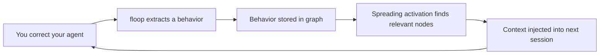

# Walkthrough: Teach Your Agent in 5 Minutes

> A hands-on tour of the floop learning loop — from first correction to automatic behavior.

## 1. Start Fresh

Pick any project directory and initialize floop:

```bash
$ cd my-project/
$ floop init --project
Created .floop
Created .claude/settings.json

Ready! Your AI agents will now load learned behaviors at session start.
```

Nothing learned yet — floop is a blank slate:

```bash
$ floop list
No behaviors learned yet (local scope).

Use 'floop learn --wrong "X" --right "Y"' to capture corrections.

$ floop active
Context:

Active behaviors (0):
```

## 2. The Mistake

You ask your AI agent to write a function that processes data from a file. It produces something like this:

```
function processFile(path):
    try:
        data = readFile(path)
        return transform(data)
    catch error:
        return null    // ← silently swallowed
```

The agent caught the error and returned `null` — no logging, no propagation. Callers have no idea something went wrong.

You correct it: *"Don't swallow errors silently — always log or propagate them."*

## 3. Capture the Correction

The agent captures the correction. Via **MCP** (recommended — your AI tool calls this automatically):

```
floop_learn(
    wrong="Silently swallowed errors without logging or propagating",
    right="Always log errors or propagate them to the caller"
)
```

Or equivalently via **CLI**:

```bash
$ floop learn \
    --wrong "Silently swallowed errors without logging or propagating" \
    --right "Always log errors or propagate them to the caller"
```

Either way, floop responds:

```
Correction captured and processed:
  Wrong: Silently swallowed errors without logging or propagating
  Right: Always log errors or propagate them to the caller

Extracted behavior:
  ID:   behavior-a1b2c3d4e5f6
  Name: learned/always-log-errors-or-propagate-them-to-the-caller
  Kind: directive
```

Verify it's stored:

```bash
$ floop list --all
Learned behaviors - all (local + global) (1):

1. [directive] learned/always-log-errors-or-propagate-them-to-the-caller
   Always log errors or propagate them to the caller
   Confidence: 0.60
```

Inspect the full behavior:

```bash
$ floop show behavior-a1b2c3d4e5f6
Behavior: behavior-a1b2c3d4e5f6
Name: learned/always-log-errors-or-propagate-them-to-the-caller
Kind: directive
Confidence: 0.60
Priority: 0

Content:
  Canonical: Always log errors or propagate them to the caller
  Expanded: When working on this type of task, avoid: Silently swallowed
    errors without logging or propagating. Instead: Always log errors or
    propagate them to the caller
```

One correction → one reusable behavior, stored in the graph.

## 4. The Payoff

Start a **new session**. The agent calls `floop active` (or floop's hooks inject context automatically):

```
Active behaviors (1):

1. [directive] learned/always-log-errors-or-propagate-them-to-the-caller
   Always log errors or propagate them to the caller
```

Now you ask the agent to write another function — this one fetches data from an API. The agent produces:

```
function fetchUser(id):
    try:
        response = httpGet("/users/" + id)
        return parseJson(response)
    catch error:
        log("Failed to fetch user " + id + ": " + error)
        throw error    // ← propagated to caller
```

The agent logged the error *and* propagated it — **without being told**. This wasn't in the code, the README, or the prompt. floop injected the learned behavior into the agent's context, and the agent followed it.

That's the loop: correct once, apply everywhere.

## 5. What Happened Under the Hood



Here's what just happened, step by step:

1. **You corrected** the agent about error handling
2. **floop extracted** a behavior — a reusable rule with activation conditions
3. **The behavior was stored** as a node in floop's graph, alongside any related behaviors
4. **In the next session**, spreading activation propagated energy from seed nodes (current file type, task) through the graph, surfacing relevant behaviors — including the one you just taught
5. **The behavior was injected** into the agent's context, and the agent applied it

As behaviors accumulate and connect, the graph gets richer. Activation cascades through associations, pulling in related context the agent wouldn't otherwise have. See [Research & Theory](SCIENCE.md) for the cognitive science behind spreading activation.

## 6. Next Steps

As your behavior store grows, you can visualize the connections between behaviors:

```bash
$ floop graph --format html
```

<p align="center">
  
  <br>
  <em>A real behavior graph with 55 nodes and 282 edges, built from corrections over time.</em>
</p>

**Keep going:**
- [Usage guide](FLOOP_USAGE.md) — Full MCP and CLI workflows
- [Integration guides](integrations/) — Setup for Claude Code, Cursor, Windsurf, and others
- [CLI reference](CLI_REFERENCE.md) — Every command and flag
- [Research & theory](SCIENCE.md) — The cognitive science behind spreading activation

Your behaviors compound — each correction makes the agent smarter.
